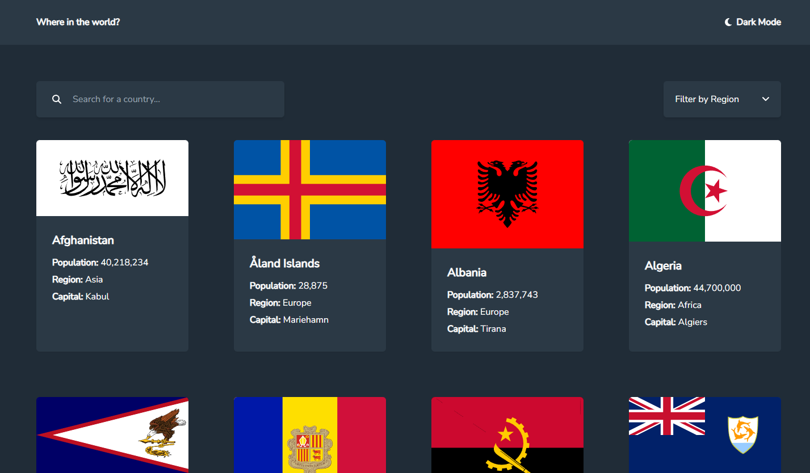

# Manuel Navarro - REST Countries API with color theme switcher

Esta es una solución al [desafío de API de países REST con conmutador de tema de color de Frontend Mentor](https://www.frontendmentor.io/challenges/rest-countries-api-with-color-theme-switcher-5cacc469fec04111f7b848ca).

## Vista Previa

## Stack Tecnológico

- Vue.js
- Tailwind CSS
- Axios

## Autor

- Website - [manuelnavarrodev.es](https://manuelnavarrodev.es/)
- Linkedln - [Manuel Navarro Higueras](https://www.linkedin.com/in/manuel-navarro-higueras/)
- Twitter - [@ManuNH98](https://www.twitter.com/ManuNH98)
